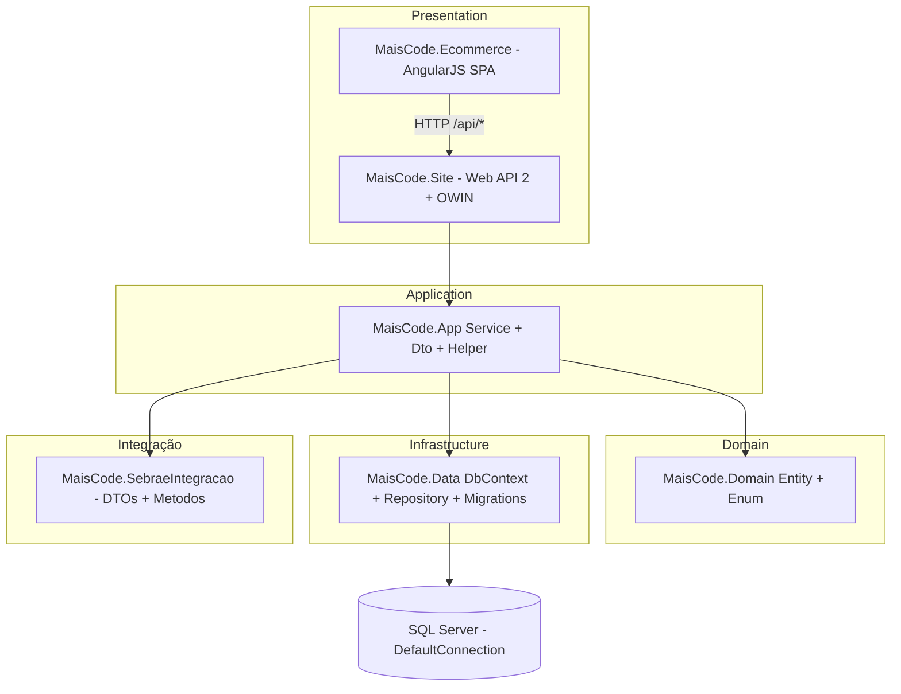

# Mapa de módulos — Fase 1 (atualizado pós-restore Git)

Legenda: módulo = área funcional delimitada por pastas de entidade + serviços correspondentes + telas AngularJS quando existirem.

**Nota:** após restauração do Git, `MaisCode.Site`, `MaisCode.IoC` e `MaisCode.SebraeIntegracao/Metodos` estão **legíveis**; o diagrama e a seção de host API abaixo refletem isso.

## Visão em camadas

**Confiança:** alta para setas conceituais e para **bootstrap** de `MaisCode.Site` / `MaisCode.IoC` (**WebApiConfig**, **BootStrapper**, **Startup.Auth** legíveis pós-restore).

## Host Web API (`MaisCode.Site`) — superfície conhecida

### Evidência de inicialização

- `MvcApplication.Application_Start` registra Web API, MVC, bundles.  
  Evidência: `MaisCode.Site/Global.asax.cs`.

- `Startup.Configuration` (OWIN) chama `ConfigureAuth` em `App_Start/Startup.Auth.cs` (OAuth `/token`, Identity, cookies, provedor externo Google).  
  Evidência: `MaisCode.Site/Startup.cs`, `MaisCode.Site/App_Start/Startup.Auth.cs`.

- `WebApiConfig.Register`: CORS `*`, `MapHttpAttributeRoutes()`, rota `api/{controller}/{id}`, apenas JSON.  
  Evidência: `MaisCode.Site/App_Start/WebApiConfig.cs`.

- MVC raiz: `HomeController.Index` redireciona para `/admin`.  
  Evidência: `MaisCode.Site/Controllers/HomeController.cs`.

### Controllers em `Controllers/Api` (por nome de arquivo)

Arquivos encontrados (34): `BannerController`, `CampanhaController`, `CategoriaController`, `ClienteListaDesejoController`, `ClientePessoaFisicaController`, `ClientePessoaJuridicaController`, `ContatoController`, `CupomController`, `CupomUsoController`, `DashboardController`, `DepoimentoController`, `EmpresaController`, `FaleConoscoController`, `FaqController`, `GaleriaProdutoController`, `HTMLPageController`, `LeadController`, `LocaleController`, `LogController`, `MenuAdmController`, `MenuController`, `ParametroSiteController`, `PedidoController`, `PerfilController`, `ProdutoController`, `ReportController`, `TermoAceiteController`, `TemaController`, `TemaProdutoController`, `UFPAisController` (nome do arquivo: `UFPaisController.cs`), `UploadFileController`, `UserController`, `VariacaoController`, `VendaController`.

**Exemplo de rotas em C#:** além de `GET api/dashboard/obter-dados` (`DashboardController`), controllers como `ProdutoController` expõem dezenas de `[Route("api/produto/...")]` alinhadas ao front (ex.: `api/produto/listarProxEventos`, `api/produto/Sync/Eventos/{PrdSync}`). Evidência: `MaisCode.Site/Controllers/Api/ProdutoController.cs`.

**Recomendação:** manter `04-fluxos.md` como narrativa de jornada; **cruzar** sistematicamente cada chamada Angular com o `[Route]` correspondente (ou com `api/{controller}/{id}`) para fechar o mapa completo.

## Módulos de domínio (backend)

| Módulo | Entidades principais | Serviços |
|--------|----------------------|----------|
| Empresas / tenant | `Empresas/Empresa`, contatos, endereços, log, menu adm | `EmpresaService`, etc. |
| Catálogo | `Produtos/*`, `Categorias/Categoria` | `ProdutoService`, … |
| Cliente | `Cliente/*` | `ClientePessoaFisicaService`, … |
| Pedido / sacola | `Pedidos/*` | `PedidoService`, … |
| Vendas / checkout | `Vendas/*` | `VendaService`, … |
| Descontos | `Descontos/*` | `CupomService`, … |
| Loja / CMS | `Loja/*` | `BannerService`, … |
| Social | `Lead`, `Depoimento` | `LeadService`, … |
| Locale | `Locale/*` | Serviços em `Locale/` |
| Account | `ApplicationUser`, `Perfil` | `UsuarioService`, … |
| Integração Sebrae | `Integracao/EventoCurso`, clientes integração | Chamadas no App + implementação em `MaisCode.SebraeIntegracao/Metodos/*.cs` (ex.: `FinanceiroService`, `EventosService`, …) **legível** |

## Módulos de front-end (AngularJS)

Inalterado em relação à 1ª passagem: `siteConfig.js`, `AngularJS/Ctrl`, `AngularJS/Svc` — ver tabela resumida na versão anterior deste arquivo (home, cursos/eventos, sacola, checkout, conta, consultoria, etc.).

## Entidade central: Produto

Inalterado: `Produto` com `ETipoProduto`, `IdEmpresa`, campos de integração Sebrae. Evidência: `MaisCode.Domain/Entity/Produtos/Produto.cs`.

## Observação DDD

Separação física por pastas; regras e SQL raw em serviços de aplicação. **Confiança:** alta.
