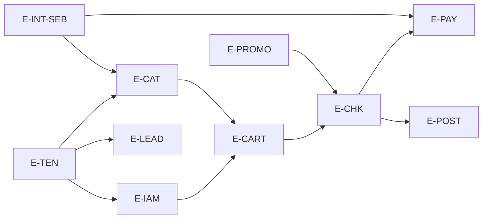

# Backlog — Épicos — Fase 2

**Agente:** *Product Backlog Builder* + *MVP Planner* (contexto).  
**Regras:** comportamento e valor de negócio; **sem** decisão de tecnologia; base apenas na Fase 1.

---

## Legenda de visões obrigatórias

| Tag | Visão |
|-----|--------|
| **V1-PARC** | Paridade funcional com o legado |
| **V2-MOD** | Modernização de produto (UX, segurança operacional, observabilidade do **produto**) |
| **V3-SEB** | Remoção/redesign de acoplamentos Sebrae |
| **V4-MT** | Capabilities multi-tenant reais |

Um épico pode cobrir **várias** visões; a coluna indica o foco principal.

---

## Mapa dos épicos

| ID | Épico | Resumo | V1 | V2 | V3 | V4 |
|----|-------|--------|:--:|:--:|:--:|:--:|
| E-FOUND | **Fundação produto e governança** | Definição de escopo, glossário, políticas transversais (sem stack) | ○ | ● | ○ | ● |
| E-TEN | **Tenant e empresa** | Cadastro, ciclo de vida e políticas da unidade de segregação | ● | ● | ○ | ● |
| E-IAM | **Identidade e acesso** | Login, perfis, autorização de negócio “quem pode o quê” | ● | ● | ○ | ● |
| E-STORE | **Storefront** | Vitrine, navegação, proximidade, depoimentos | ● | ● | ○ | ○ |
| E-CAT | **Catálogo e produto** | Tipos de produto, publicação, fichas, relacionamentos | ● | ● | ● | ● |
| E-CART | **Sacola e pedido** | Ciclo do pedido, linhas, regras de status | ● | ● | ○ | ● |
| E-PROMO | **Promoções e campanhas** | Cupom, campanhas (entidades na Fase 1) | ● | ○ | ○ | ● |
| E-CHK | **Checkout e venda** | Conclusão da compra, termos, transição pedido→venda | ● | ● | ● | ● |
| E-PAY | **Pagamento** | Meios aceitos, autorização/captura no nível **negócio** (não adquirente) | ● | ● | ● | ○ |
| E-CUST | **Cliente** | PF/PJ, endereços, integrações cadastrais | ● | ○ | ● | ● |
| E-POST | **Pós-compra** | Histórico, downloads, lista de desejos | ● | ● | ○ | ○ |
| E-CMS | **Conteúdo e institucional** | HTML, FAQ, Fale Conosco | ● | ● | ○ | ● |
| E-LEAD | **Lead e notificações** | Captura, destino correto por tenant | ● | ○ | ○ | ● |
| E-INT-SEB | **Integração Sebrae (adapter)** | Eventos/cursos, consultoria, reservas, financeiro, CEP | ● | ○ | ● | ● |
| E-ADM | **Operação e admin** | Dashboard, relatórios, menus admin, upload, parâmetros | ● | ● | ○ | ● |
| E-OBS | **Confiabilidade do produto** | Rastreabilidade, auditoria de negócio, SLAs percebidos | ○ | ● | ○ | ○ |

---

## Descrição por épico (objetivo de negócio)

### E-FOUND — Fundação produto e governança
Garantir linguagem comum, critérios de classificação (paridade vs débito vs Sebrae vs tenant) e portões de qualidade **de produto** antes de escalar entrega.

### E-TEN — Tenant e empresa
Permitir que cada **empresa** opere com dados isolados e políticas próprias (marca, parâmetros, limites), alinhado ao modelo `IdEmpresa` da Fase 1.

### E-IAM — Identidade e acesso
Autenticar usuários, aplicar perfis e garantir que operações de loja e admin respeitem o contexto autorizado (lacuna parcial na Fase 1 — explicitar como discovery).

### E-STORE — Storefront
Reproduzir a experiência de descoberta da loja (home, listagens, depoimentos, proximidade).

### E-CAT — Catálogo e produto
Gerir produtos por tipo, publicação e visibilidade; suportar relacionamentos (categoria, tema, pacote) evidenciados na Fase 1.

### E-CART — Sacola e pedido
Manter pedido ativo com identificação amigável (RB-004) e regras de limpeza/remoção (RB-005).

### E-PROMO — Promoções e campanhas
Aplicar cupom com janela de validade (RB-006) e evoluir para campanhas coerentes com entidades existentes.

### E-CHK — Checkout e venda
Concluir compra criando venda a partir do pedido (RB-007), com termos quando exigidos.

### E-PAY — Pagamento
Orquestrar o **momento** de cobrança e o registro de pagamento no negócio; tratar inscrição paga com integração financeira (RB-009) como caso especial **Sebrae** até desacoplamento.

### E-CUST — Cliente
Cadastro PF/PJ com endereços; integrações de consulta (Sebrae) como capacidade explícita.

### E-POST — Pós-compra
Acesso a histórico, downloads por tipo de produto, lista de desejos.

### E-CMS — Conteúdo e institucional
Páginas dinâmicas, FAQ, contato — por empresa onde aplicável.

### E-LEAD — Lead
Captura com **destino correto por tenant** (corrigir RB-012).

### E-INT-SEB — Integração Sebrae
Concentrar tudo que hoje depende de `MaisCode.SebraeIntegracao`, `EventoCurso`, campos de produto e endpoints de cadastro/sync — com meta de **anti-corrupção** e contratos versionados (visão V3).

### E-ADM — Operação e admin
Dashboard (`api/dashboard/obter-dados` na Fase 1), relatórios, gestão de menus admin, upload, parâmetros de site.

### E-OBS — Confiabilidade do produto
Expor ao negócio indicadores mínimos de saúde (filas de integração, falhas de pagamento, taxa de erro de checkout) **como requisitos de produto**, sem definir ferramenta.

---

## Matriz: visão obrigatória × épicos tocados

| Visão | Épicos onde o trabalho aparece de forma central |
|-------|---------------------------------------------------|
| **V1 Paridade** | E-STORE, E-CAT, E-CART, E-PROMO, E-CHK, E-PAY, E-CUST, E-POST, E-CMS, E-LEAD, E-INT-SEB, E-ADM, E-IAM, E-TEN |
| **V2 Modernização** | E-FOUND, E-IAM, E-STORE, E-CAT, E-CART, E-CHK, E-PAY, E-POST, E-CMS, E-ADM, E-OBS |
| **V3 Sebrae** | E-CAT, E-CHK, E-PAY, E-CUST, E-INT-SEB |
| **V4 Multi-tenant** | E-FOUND, E-TEN, E-IAM, E-CAT, E-CART, E-PROMO, E-CUST, E-CMS, E-LEAD, E-INT-SEB |

---

## Dependências entre épicos (negócio)

---

## Rastreio Fase 1 → épicos

| Artefato Fase 1 | Épicos |
|-----------------|--------|
| Fluxos F1–F3 | E-STORE, E-CAT |
| F4–F5 | E-CART, E-PROMO, E-CHK, E-PAY, E-INT-SEB |
| F6 | E-IAM, E-CUST, E-INT-SEB |
| F7 | E-POST |
| F8 | E-CMS |
| F9–F10 | E-INT-SEB, E-CAT |
| F11 | E-LEAD |
| RB-010–012 | E-TEN, E-CUST, E-LEAD, E-CAT |
| RB-003, RB-009 | E-CAT, E-INT-SEB, E-PAY |
