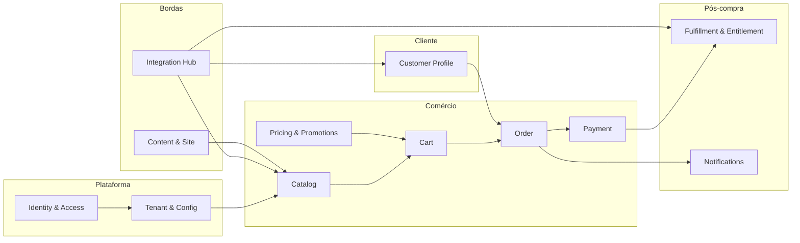

# Bounded contexts oficiais

**Estilo:** DDD pragmático; fronteiras orientadas a **coesão de linguagem** e **ciclo de vida de consistência**.  
**Premissa:** **monólito modular** no MVP; contextos podem virar serviços **só** com pré-requisitos (testes, observabilidade, limites claros) — ver `08-events-kafka-saga-decision.md`.  

---

## Mapa resumido

---

## Contextos (definição oficial)

| # | Contexto | Responsabilidade | Consistência | Relação com legado (discovery) |
|---|----------|------------------|--------------|--------------------------------|
| **BC01** | **Tenant & Platform Config** | Resolução de tenant, branding, parâmetros de loja, feature flags, limites comerciais por tenant. | Forte por tenant. | **Fato:** `ParametroSite`, empresa proliferada; **Decisão:** policy explícita e auditável. |
| **BC02** | **Identity & Access** | Autenticação, sessão, RBAC, convites, vínculo usuário↔tenant. | Forte. | **Fato:** gaps de auth no legado; **Decisão:** OIDC-first, APIs sem `First()` implícito. |
| **BC03** | **Catalog** | Produtos, tipos/famílias (curso, evento, download, consultoria), mídia, disponibilidade **como conceito**; não executa pagamento. | Forte no agregado produto. | **Fato:** `ETipoProduto` como ancora conceitual; **Decisão:** modelo novo. |
| **BC04** | **Pricing & Promotions** | Preço base, tabelas, campanhas, cupom **como regra de desconto** aplicável ao carrinho. | Forte; eventos para Cart. | **Fato:** cupom×carrinho com gaps; **Decisão:** serviço de aplicação claro + idempotência. |
| **BC05** | **Cart (Shopping)** | Sacola, linhas, validações de elegibilidade, expiração. | Forte por `cartId`. | **Fato:** sacola existente; **Decisão:** anti-abuse e limites por tenant. |
| **BC06** | **Order** | Pedido, transição de estado, snapshot de preço, vínculo a cliente e tenant. | Forte por `orderId`. | **Fato:** RB checkout no legado; **Decisão:** máquina de estados explícita + auditoria. |
| **BC07** | **Payment** | Intenção de pagamento, provedores, webhooks, reconciliação, idempotency keys. | Forte; integra com Order via **portas**. | **Fato:** adquirente legado indeterminado E2E; **Decisão:** provider plugável. |
| **BC08** | **Customer Profile** | Cadastro PF/PJ, consentimento, endereços; **não** substitui IAM. | Forte por `customerId`. | **Fato:** integrações cadastrais Sebrae; **Decisão:** adapter no Hub. |
| **BC09** | **Fulfillment & Entitlement** | Pós-compra: acesso a conteúdo, inscrição, reserva de vaga, entrega digital. | Forte por entidade de fulfillment. | **Fato:** eventos/educação; **Decisão:** orquestração local ao monólito no MVP. |
| **BC10** | **Notifications** | E-mail/SMS/push; templates por tenant; fila outbound. | Eventual. | **Fato:** risco notificar tenant errado; **Decisão:** tenantId obrigatório em todo payload. |
| **BC11** | **Integration Hub** | Anti-Corruption Layer para Sebrae e terceiros; contratos versionados, circuit breaker, auditoria. | Por integração. | **Fato:** acoplamento no legado; **Decisão:** única porta de saída “oficial”. |
| **BC12** | **Content & Site** | Institucional, FAQ, SEO, páginas leves; opcional headless CMS depois. | Eventual. | **Fato:** conteúdo institucional; **Decisão:** não misturar com Cart. |

---

## Contextos “supporting” transversais (não são domínios de negócio isolados)

| Área | Tratamento |
|------|------------|
| **Observabilidade** | Padrão técnico em todos os módulos (OTel, logs estruturados, tracing). |
| **Auditoria** | Serviço de plataforma consumido por BC01, BC06, BC07, BC11. |
| **Arquivos** | Adapter de storage (S3-compatible) usado por BC03/CMS — não é contexto de compra. |

---

## Integrações entre contextos (regras)

1. **Dependência:** fluxo permitido principalmente **unidirecional** conforme diagrama; evitar BC03→BC07 direto.  
2. **Contratos:** módulos expõem **use cases** (ports); integrações externas só em BC11 e BC07 (adapters).  
3. **Dados:** sem **modelo anêmico compartilhado** entre contextos; DTOs de aplicação ou eventos versionados.  

---

## Fato / Decisão / Risco

| Tipo | Conteúdo |
|------|----------|
| **Fato** | Legado mistura catálogo, financeiro e cadastro em profundidade. |
| **Decisão** | Fronteiras acima são **oficiais** para o greenfield; mudança exige ADR. |
| **Hipótese** | `Pricing & Promotions` pode fundir-se a `Catalog` se o time for pequeno — revisar após Wave 1. |
| **Risco** | “Shared kernel” grande demais — mitigar com code ownership por módulo e testes de contrato entre pacotes. |
